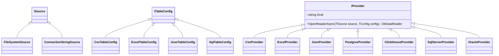

# Архитектура Loader

## Цель

Библиотека строится снизу вверх вокруг потоковых табличных данных.

Базовый контракт:

```text
Источник + конфиг таблицы + провайдер -> DbDataReader -> типизированная потоковая обертка
```

Провайдеры умеют только открывать данные. Они не решают, куда сохранять результат, как создавать финальные таблицы, как фильтровать и как проектировать поля.

## Основные понятия

- `Source` описывает, где лежат данные.
- `TableConfig` описывает, что именно читать: файл, лист Excel, SQL-запрос и так далее.
- `Provider` принимает source с нужной возможностью доступа и конкретный `TableConfig`, затем выдает `DbDataReader`.
- `TypedDbDataReader` оборачивает любой `DbDataReader` и показывает нормализованные `DataType`.
- `Row` позже станет фасадом доступа к строке для потоковых трансформаций.

## CSV Reader Wrapper

CSV provider возвращает не сырой Sylvan reader, а wrapper над ним.

Wrapper фиксирует контракт Loader:

- CSV без header получает имена колонок как в Excel: `A`, `B`, ..., `Z`, `AA`, `AB`.
- Если в строке меньше значений, чем в схеме, отсутствующие значения возвращаются как `DBNull`.
- Если в строке больше значений, чем в схеме, лишние значения игнорируются.
- Ошибки формата CSV нормализуются в provider exceptions.

## Форма провайдера



## Текущие провайдеры

```mermaid
flowchart LR
    FileSource[FileSystemSource] --> CsvProvider
    CsvConfig[CsvTableConfig] --> CsvProvider
    CsvProvider --> CsvReader[DbDataReader]

    FileSource --> ExcelProvider
    ExcelConfig[ExcelTableConfig] --> ExcelProvider
    ExcelProvider --> ExcelReader[DbDataReader]

    FileSource --> JsonProvider
    JsonConfig[JsonTableConfig] --> JsonProvider
    JsonProvider --> JsonReader[DbDataReader]

    DbSource[ConnectionStringSource] --> PgProvider[PostgresProvider]
    SqlConfig[SqlTableConfig] --> PgProvider
    PgProvider --> PgReader[DbDataReader]

    DbSource --> ChProvider[ClickHouseProvider]
    SqlConfig --> ChProvider
    ChProvider --> ChReader[DbDataReader]

    DbSource --> SqlServerProvider[SqlServerProvider]
    SqlConfig --> SqlServerProvider
    SqlServerProvider --> SqlServerReader[DbDataReader]

    DbSource --> OracleProvider[OracleProvider]
    SqlConfig --> OracleProvider
    OracleProvider --> OracleReader[DbDataReader]

    CsvReader --> Typed[TypedDbDataReader]
    ExcelReader --> Typed
    JsonReader --> Typed
    PgReader --> Typed
    ChReader --> Typed
    SqlServerReader --> Typed
    OracleReader --> Typed
```



## Планируемый Stream API

`Where` и `Select` уже заведены как заглушки с `NotImplementedException`.

Целевая форма:

```csharp
reader
    .Where(row => row.Text("name").ToLowerInvariant() == "moscow")
    .Select(new Dictionary<string, Func<Row, object?>>
    {
        ["name_lower"] = row => row.Text("name").ToLowerInvariant()
    });
```

Этот слой должен жить над `DbDataReader`, а не внутри провайдеров.
