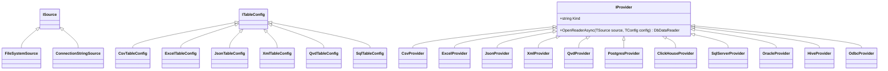

# Архитектура Loader

## Слои

```text
Loader.Core   -> providers, sources, DbDataReader decorators, ClickHouse writer
Loader.Lang   -> parser expressions/statements/script
Loader.Query  -> expression resolver, functions, ClickHouse query compiler
Loader.Script -> script execution over providers + ClickHouse staging/final tables
```

Базовый контракт чтения:

```text
Source + TableConfig + Provider -> DbDataReader -> Normalize() -> DomainDataReader
```

Script/materialization контракт:

```text
LOAD statement -> provider reader -> temp ClickHouse -> Query -> final ClickHouse -> LoadedTable
```

## Основные понятия Core

- `Source` описывает, где лежат данные.
- `TableConfig` описывает, что читать из source.
- `Provider` открывает `DbDataReader`.
- `DomainDataReader` добавляет `DataSchema` и доменный ADO.NET contract.
- `Normalize()` переводит обычный `DbDataReader` в `DomainDataReader`.
- `AutoCast`, `Where`, `Limit`, `CollectMeta` работают поверх `DomainDataReader`.
- `ClickHouseWriter` потоково пишет `DbDataReader` в ClickHouse.

## Providers


```mermaid
classDiagram
    class ISource
    class ITableConfig
    class IProvider {
        +string Kind
    }
    class IProvider~TSource,TConfig~ {
        +OpenReaderAsync(TSource source, TConfig config) DbDataReader
    }

    ISource <|-- FileSystemSource
    ISource <|-- ConnectionStringSource

    ITableConfig <|-- CsvTableConfig
    ITableConfig <|-- ExcelTableConfig
    ITableConfig <|-- JsonTableConfig
    ITableConfig <|-- XmlTableConfig
    ITableConfig <|-- QvdTableConfig
    ITableConfig <|-- SqlTableConfig

    IProvider <|-- CsvProvider
    IProvider <|-- ExcelProvider
    IProvider <|-- JsonProvider
    IProvider <|-- XmlProvider
    IProvider <|-- QvdProvider
    IProvider <|-- PostgresProvider
    IProvider <|-- ClickHouseProvider
    IProvider <|-- SqlServerProvider
    IProvider <|-- OracleProvider
    IProvider <|-- HiveProvider
    IProvider <|-- OdbcProvider
```

## File providers

- CSV provider оборачивает Sylvan reader и фиксирует CSV contract.
- Excel provider читает через Sylvan Excel.
- JSON provider потоковый; schema analysis и data reader не материализуют весь документ.
- XML provider потоковый и поддерживает flat table по имени элемента строки.
- QVD provider читает строки потоково, но symbol tables загружаются заранее.

## Query layer

`Loader.Query` не знает о providers.
Он получает:

- `QuerySource.Sql`
- `QuerySource.Alias`
- `QuerySource.Fields` с логическими aliases, templates и типами
- `Query.Select`, `Where`, `GroupBy`, `OrderBy`, `Limit`, `Offset`

Затем:

```text
Query -> QueryResolver -> ResolvedQuery -> ClickHouseQueryCompiler -> SQL
```

## Script layer

`Loader.Script` связывает source/provider слой с Query:

1. `LoadProviderResolver` выбирает provider по `FROM ProviderName(options)`.
2. Provider reader переименовывается в физические `column1`, `column2`, ...
3. Reader нормализуется и пишется в temp ClickHouse table.
4. `LoadStatement` превращается в `Query` над temp table.
5. Query выполняется в ClickHouse и результат пишется в final table.
6. Возвращается `LoadedTable`.

Temp table удаляется best-effort.
Final table удаляется только если materialization не была успешно committed.
