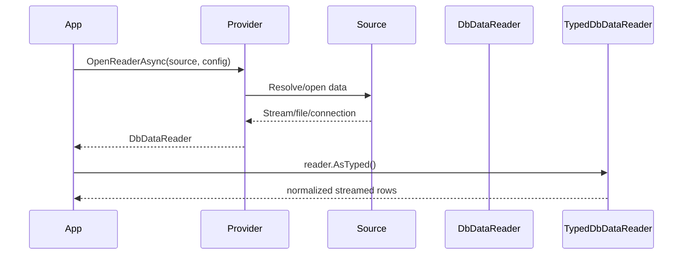

# Поток данных

## Pipeline чтения

## Почему Source отделен от Provider

Провайдер описывает логику чтения и зависит от возможностей source, а не от provider-specific marker-ов.

Источник описывает место и способ доступа:

- `FileSystemSource` для файловых провайдеров CSV, Excel, JSON, XML и QVD.
- `ConnectionStringSource` для DB-провайдеров Postgres, ClickHouse, Microsoft SQL Server и Oracle.

Позже можно добавлять новые источники, не меняя смысл провайдера:

- CSV из S3
- Excel по HTTP
- подключение к БД из Vault

## Чего нет в этом слое

Этот слой не создает финальные таблицы в БД.

Этот слой не выбирает постоянное хранилище.

Этот слой пока не выполняет трансформации.

Все это отдельные уровни pipeline/materialization выше текущей библиотеки.
