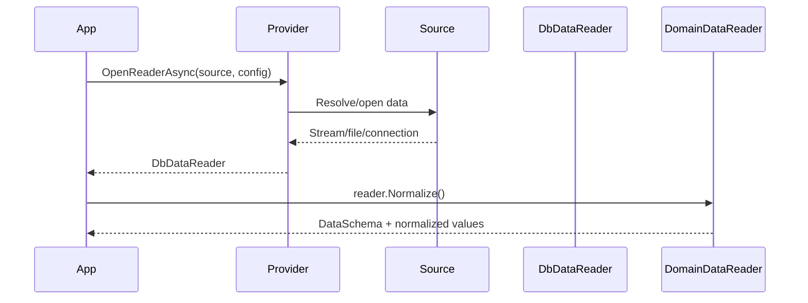
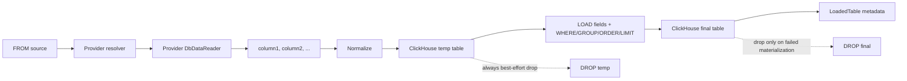

# Поток данных

## Базовое чтение

```mermaid
sequenceDiagram
    participant App
    participant Provider
    participant Source
    participant Reader as DbDataReader
    participant Domain as DomainDataReader

    App->>Provider: OpenReaderAsync(source, config)
    Provider->>Source: Resolve/open data
    Source-->>Provider: Stream/file/connection
    Provider-->>App: DbDataReader
    App->>Domain: reader.Normalize()
    Domain-->>App: DataSchema + normalized values
```

Provider отвечает только за чтение source и выдачу `DbDataReader`.
Доменный pipeline начинается после `Normalize()` и работает поверх стандартного `DbDataReader`.

## Script execution

`Loader.Script` добавляет materialization pipeline поверх provider/query слоев:

```mermaid
flowchart LR
    From[FROM source] --> Provider[Provider resolver]
    Provider --> RawReader[Provider DbDataReader]
    RawReader --> StageNames[column1, column2, ...]
    StageNames --> Normalize[Normalize]
    Normalize --> Temp[ClickHouse temp table]
    Temp --> Query[LOAD fields + WHERE/GROUP/ORDER/LIMIT]
    Query --> Final[ClickHouse final table]
    Final --> Loaded[LoadedTable metadata]

    Temp -. always best-effort drop .-> DropTemp[DROP temp]
    Final -. drop only on failed materialization .-> DropFinal[DROP final]
```

Важные правила:

- Temp table хранит физические имена `column1`, `column2`, ... .
- `QuerySource.Field.Template` связывает логические source names с физическими temp columns.
- Final table получает результат `Query -> Resolve -> Compile -> ClickHouse reader -> ClickHouseWriter`.
- `LoadedTable.Name` хранит физическое имя final table в БД.
- `LoadedTable.Alias` хранит имя таблицы из script (`table_name: LOAD`).

## Source abstraction

- `FileSystemSource` используется для CSV, Excel, JSON, XML и QVD.
- `ConnectionStringSource` используется для Postgres, ClickHouse, SQL Server, Oracle и Hive.

Новые источники должны добавляться через source abstraction, не меняя смысл provider-а.
