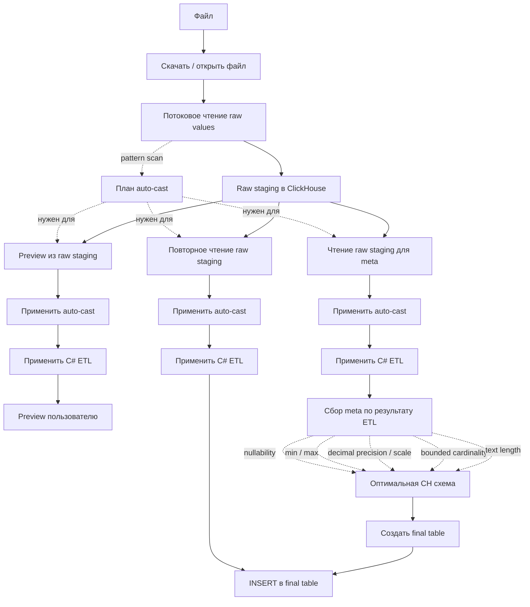
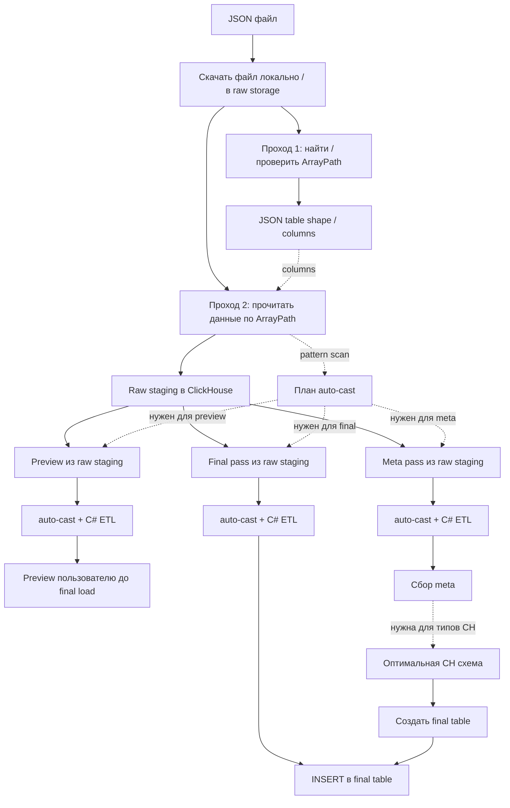

# Схема загрузки файлов

## Общий путь

```mermaid
flowchart TD
    File[Файл] --> Download[Скачать / открыть файл]
    Download --> RawScan[Потоковое чтение raw values]
    RawScan --> RawStage[Raw staging в ClickHouse]

    RawScan -. pattern scan .-> CastPlan[План auto-cast]
    CastPlan -. нужен для .-> PreviewRead
    CastPlan -. нужен для .-> MetaRead
    CastPlan -. нужен для .-> FinalRead

    RawStage --> PreviewRead[Preview из raw staging]
    PreviewRead --> PreviewCast[Применить auto-cast]
    PreviewCast --> PreviewEtl[Применить C# ETL]
    PreviewEtl --> Preview[Preview пользователю]

    RawStage --> MetaRead[Чтение raw staging для meta]
    MetaRead --> MetaCast[Применить auto-cast]
    MetaCast --> MetaEtl[Применить C# ETL]
    MetaEtl --> MetaCollect[Сбор meta по результату ETL]

    MetaCollect -. nullability .-> FinalSchema[Оптимальная CH схема]
    MetaCollect -. min / max .-> FinalSchema
    MetaCollect -. decimal precision / scale .-> FinalSchema
    MetaCollect -. bounded cardinality .-> FinalSchema
    MetaCollect -. text length .-> FinalSchema

    FinalSchema --> FinalTable[Создать final table]

    RawStage --> FinalRead[Повторное чтение raw staging]
    FinalRead --> FinalCast[Применить auto-cast]
    FinalCast --> FinalEtl[Применить C# ETL]
    FinalEtl --> FinalInsert[INSERT в final table]
    FinalTable --> FinalInsert
```

## JSON путь

```mermaid
flowchart TD
    JsonFile[JSON файл] --> Download[Скачать файл локально / в raw storage]

    Download --> AnalyzePathRead[Проход 1: найти / проверить ArrayPath]
    AnalyzePathRead --> JsonSchema[JSON table shape / columns]

    Download --> RawLoadRead[Проход 2: прочитать данные по ArrayPath]
    JsonSchema -. columns .-> RawLoadRead
    RawLoadRead --> RawStage[Raw staging в ClickHouse]

    RawLoadRead -. pattern scan .-> CastPlan[План auto-cast]

    RawStage --> PreviewRead[Preview из raw staging]
    CastPlan -. нужен для preview .-> PreviewRead
    PreviewRead --> PreviewEtl[auto-cast + C# ETL]
    PreviewEtl --> Preview[Preview пользователю до final load]

    RawStage --> MetaRead[Meta pass из raw staging]
    CastPlan -. нужен для meta .-> MetaRead
    MetaRead --> MetaEtl[auto-cast + C# ETL]
    MetaEtl --> MetaCollect[Сбор meta]

    MetaCollect -. нужна для типов CH .-> FinalSchema[Оптимальная CH схема]
    FinalSchema --> FinalTable[Создать final table]

    RawStage --> FinalRead[Final pass из raw staging]
    CastPlan -. нужен для final .-> FinalRead
    FinalRead --> FinalEtl[auto-cast + C# ETL]
    FinalEtl --> FinalInsert[INSERT в final table]
    FinalTable --> FinalInsert
```
