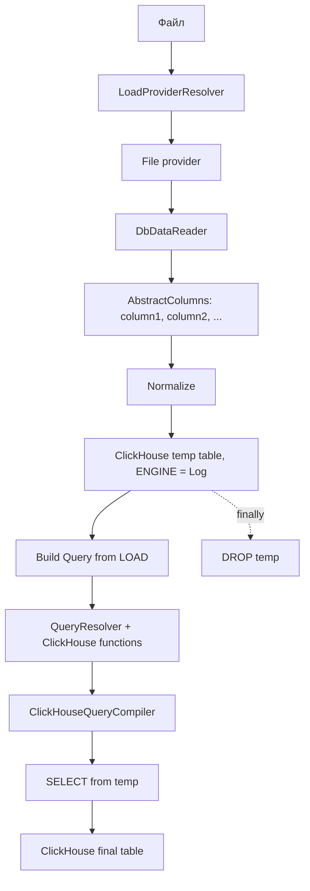

# Загрузка файлов через Script

Этот документ описывает текущий путь file source в `Loader.Script`.
Preview raw data остается отдельной продуктовой задачей и не входит в этот pipeline.

## Общий путь



## Что происходит по source

- CSV/Excel/QVD открываются одним reader pass.
- JSON/XML сначала анализируют схему, затем открывают reader по полученной схеме.
- JSON reader потоковый; root array и flat known schema используют быстрый flat reader.
- XML reader потоковый и поддерживает только flat table shape по имени элемента строки.

## Где выполняются преобразования

Преобразования `LOAD` не выполняются в C# row-by-row.

Текущий путь:

```text
source -> temp ClickHouse -> SQL SELECT transformations -> final ClickHouse
```

`LOAD` превращается в `Query`, затем:

```text
Query -> ResolvedQuery -> ClickHouse SQL -> reader -> ClickHouseWriter
```

## Temp и final

- Temp table должна быть короткоживущей и удаляется best-effort в `finally`.
- Final table удаляется только если materialization не была успешно committed.
- Сейчас temp/final физические имена генерируются executor-ом, а script alias хранится отдельно в `LoadedTable.Alias`.
