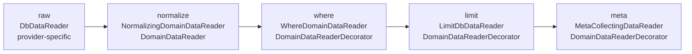
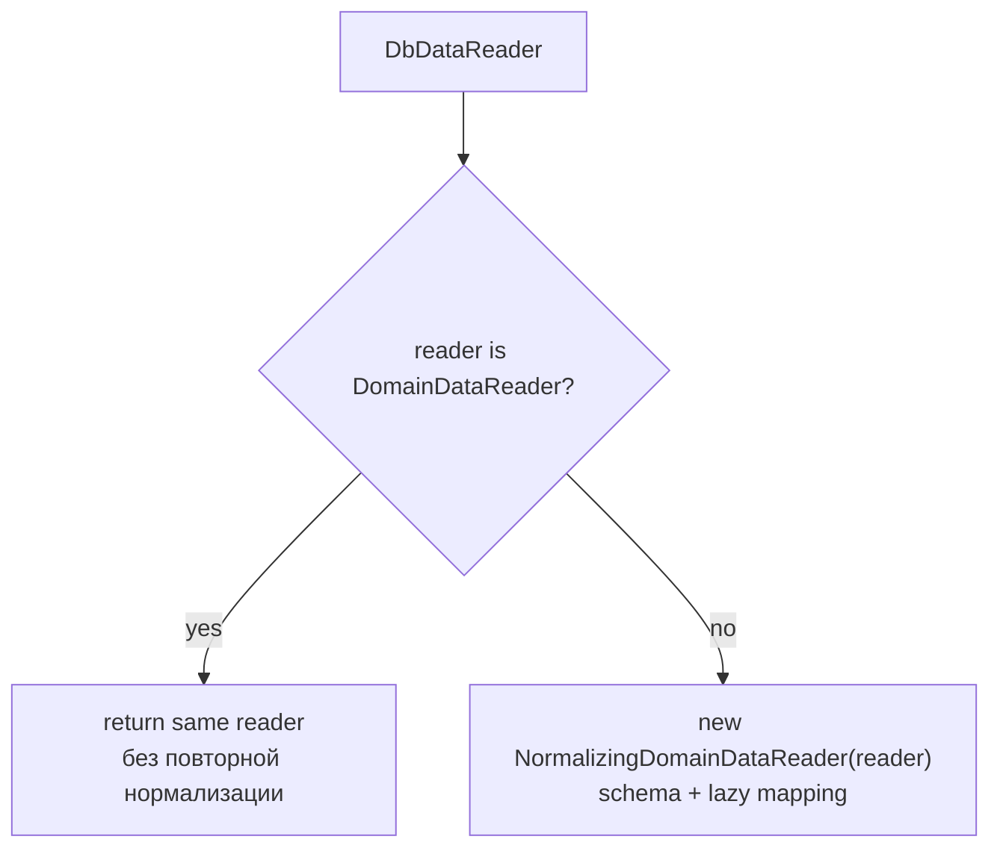

# Reader Pipeline

## Слои

## Provider-specific пример CSV

`CsvProviderDataReader` остается provider-specific слоем: он фиксирует CSV-контракт до доменной нормализации.

## Правило нормализации

`Normalize()` idempotent: если reader уже доменный, повторный вызов не создает второй normalizer.

## Техническая буферизация

Буферизация не меняет доменный pipeline, поэтому не показывается отдельным слоем на схемах.

`Normalize()` по умолчанию оборачивает lazy-нормализацию в `BufferingDomainDataReader`. Он материализует одну текущую строку в `object[]` во время `Read`, чтобы поля текущей строки можно было безопасно читать в любом порядке.

`Normalize(new NormalizeOptions { Buffer = false })` отключает этот слой. Это быстрее, но повторный `GetValue` повторно читает/конвертирует значение, а sequential provider может не поддержать произвольный порядок чтения.

## Ответственность классов

- `NormalizingDomainDataReader` строит `DataSchema` и применяет mapping/conversion лениво в `GetValue`.
- `BufferingDomainDataReader` технически буферизует одну текущую строку, но не добавляет нового доменного шага.
- `DomainDataReaderDecorator` переиспользует нормализованную схему и значения inner reader, но держит собственный флаг `HasReadableRow`.
- `WhereDomainDataReader` двигает inner reader до строки, прошедшей predicate.
- `LimitDbDataReader` останавливает чтение после заданного количества строк.
- `MetaCollectingDataReader` собирает meta по строкам, которые реально прошли до него в pipeline.
