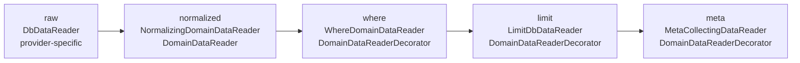
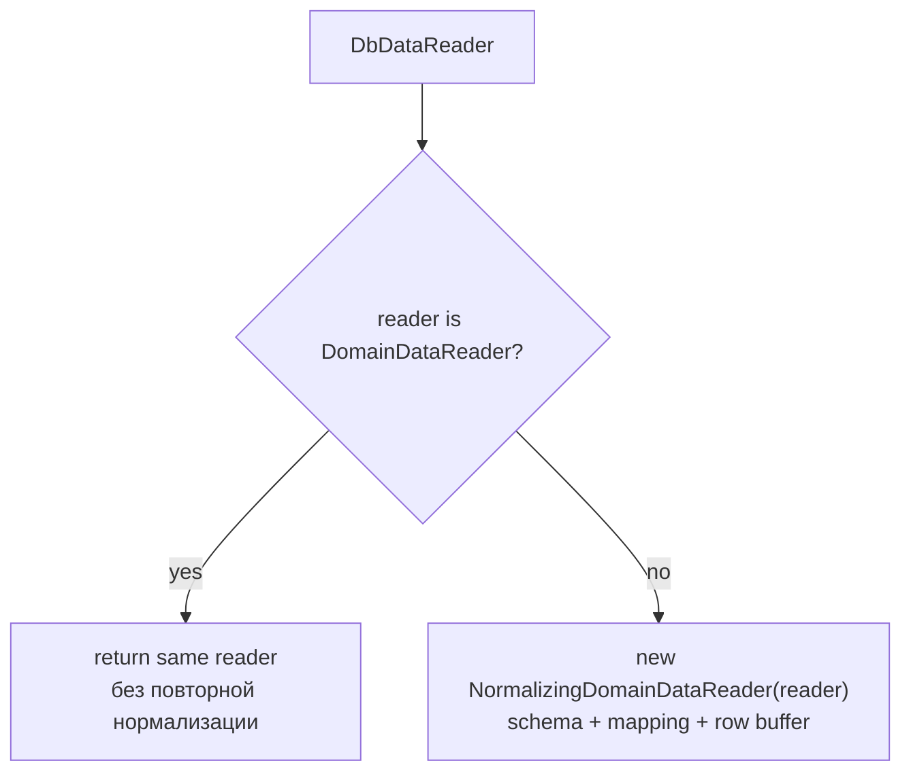

# Reader Pipeline

## Слои

## Provider-specific пример CSV

```mermaid
flowchart LR
    source["source<br/>IFileSource<br/>OpenRead(fileName)"]
    sylvan["csv raw<br/>CsvDataReader<br/>DbDataReader"]
    csv_wrapper["csv contract<br/>CsvProviderDataReader<br/>DbDataReaderDecorator"]
    normalized["normalized<br/>NormalizingDomainDataReader<br/>DomainDataReader"]
    where["where<br/>WhereDomainDataReader<br/>DomainDataReaderDecorator"]
    limit["limit<br/>LimitDbDataReader<br/>DomainDataReaderDecorator"]
    meta["meta<br/>MetaCollectingDataReader<br/>DomainDataReaderDecorator"]

    source --> sylvan --> csv_wrapper --> normalized --> where --> limit --> meta
```

`CsvProviderDataReader` остается provider-specific слоем: он фиксирует CSV-контракт до доменной нормализации.

## Правило нормализации

`Normalize()` idempotent: если reader уже доменный, повторный вызов не создает второй normalizer.

## Ответственность классов

- `NormalizingDomainDataReader` строит `DataSchema`, применяет mapping/conversion и буферизует одну текущую строку.
- `DomainDataReaderDecorator` переиспользует уже нормализованную схему и значения, но держит собственный флаг `HasReadableRow`.
- `WhereDomainDataReader` двигает inner reader до строки, прошедшей predicate.
- `LimitDbDataReader` останавливает чтение после заданного количества строк.
- `MetaCollectingDataReader` собирает meta по строкам, которые реально прошли до него в pipeline.

`HasReadableRow` нужен каждому доменному декоратору, чтобы после `Read() == false` не отдавать старое значение из inner reader.
