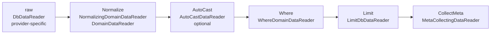
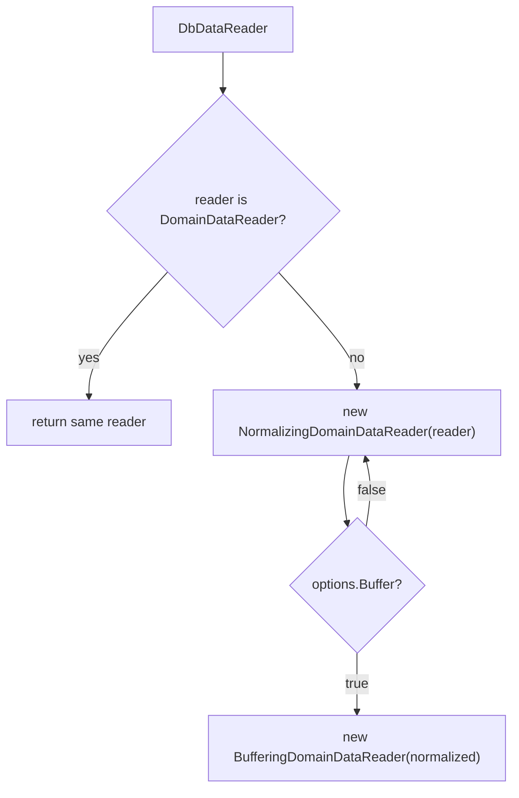
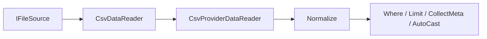

# Reader Pipeline

## Слои

```mermaid
flowchart LR
    raw["raw<br/>DbDataReader<br/>provider-specific"]
    normalized["Normalize<br/>NormalizingDomainDataReader<br/>DomainDataReader"]
    autocast["AutoCast<br/>AutoCastDataReader<br/>optional"]
    where["Where<br/>WhereDomainDataReader"]
    limit["Limit<br/>LimitDbDataReader"]
    meta["CollectMeta<br/>MetaCollectingDataReader"]

    raw --> normalized --> autocast --> where --> limit --> meta
```

`Normalize()` является входом в доменный reader pipeline.
После него reader имеет `DataSchema`, корректные typed getters и ADO.NET schema, вычисленную по доменной схеме.

## Normalize

```mermaid
flowchart TD
    input["DbDataReader"]
    is_domain{"reader is DomainDataReader?"}
    same["return same reader"]
    normalize["new NormalizingDomainDataReader(reader)"]
    buffer{"options.Buffer?"}
    buffered["new BufferingDomainDataReader(normalized)"]

    input --> is_domain
    is_domain -->|yes| same
    is_domain -->|no| normalize
    normalize --> buffer
    buffer -->|true| buffered
    buffer -->|false| normalize
```

`Normalize()` idempotent: если reader уже доменный, повторный вызов не создает второй normalizer.

`NormalizeOptions.Buffer` по умолчанию `false`.
Буферизация остается доступной для provider-ов, которым нужно материализовать текущую строку перед произвольным чтением полей, но по умолчанию pipeline идет без буфера.

## Техническая буферизация

`BufferingDomainDataReader` материализует одну текущую строку в `object[]` во время `Read`.
Это безопаснее для sequential readers, но дает лишние аллокации, поэтому не используется без явного `Buffer = true`.

## AutoCast

`AutoCast` применяется только к текстовым полям и меняет `DataSchema`/ADO schema.
Не указанные в `AutoCastSchema` поля остаются без изменений.

AutoCast analyzer может собрать схему вторым проходом, но сам `AutoCastDataReader` конвертирует значения лениво при чтении поля.

## Provider-specific пример CSV

```mermaid
flowchart LR
    source["IFileSource"]
    sylvan["CsvDataReader"]
    wrapper["CsvProviderDataReader"]
    normalize["Normalize"]
    pipeline["Where / Limit / CollectMeta / AutoCast"]

    source --> sylvan --> wrapper --> normalize --> pipeline
```

`CsvProviderDataReader` фиксирует CSV-specific контракт до доменной нормализации:

- CSV без header получает имена колонок `A`, `B`, ..., `Z`, `AA`, ...
- Missing values возвращаются как `DBNull`.
- Extra values за пределами схемы игнорируются.
- Ошибки CSV нормализуются в provider exceptions.
